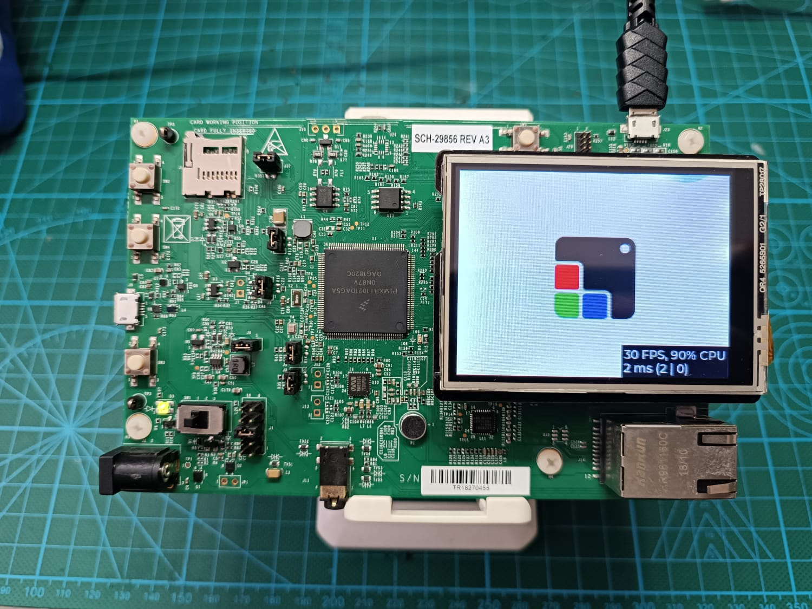

# test_sdram_lpspi_edma_lcd_lvgl

Bare-metal project running **LVGL 9** on the **NXP IMXRT1020-EVK** evaluation board. It drives an ILI9341 320x240 SPI LCD with a 4-wire resistive touchscreen, using DMA-accelerated SPI transfers and SDRAM-backed frame buffers. The default demo is the **LVGL Music Player**.<br>
<br><br>

## Hardware

| Component | Details |
|---|---|
| Board | NXP MIMXRT1020-EVK (Cortex-M7 @ 500 MHz) |
| Display | ILI9341 320x240 TFT LCD (16-bit RGB565, landscape) |
| Touch | 4-wire resistive touchscreen (ADC-based, no touch IC) |
| Flash | 8 MB QSPI NOR (XIP) |
| SDRAM | 32 MB via SEMC (base 0x80000000) |

## Key Features

- **LPSPI with eDMA** -- LCD pixel data is transferred over LPSPI1 at 40 MHz using eDMA in continuous TX-only mode (`CONT+CONTC+BYSW+RXMSK`), enabling fully asynchronous flushing so LVGL can render the next frame while the current one is being transmitted.
- **SDRAM frame buffers** -- Two partial-screen buffers (~30 KB each, 1/5 of screen) are placed in SDRAM. LVGL uses double-buffered partial rendering mode (`LV_DISPLAY_RENDER_MODE_PARTIAL`).
- **D-Cache coherency** -- `DCACHE_CleanByRange()` is called before every DMA transfer to flush pixel data from cache to SDRAM, ensuring DMA reads coherent data. DMA handles themselves are placed in non-cacheable memory.
- **SDRAM initialization via DCD** -- SDRAM is configured through the Device Configuration Data (DCD) boot header, so SEMC is fully initialized by the ROM bootloader before application code runs.
- **4-wire resistive touch** -- Touchscreen input is read directly via ADC channels (ADC1 CH10-CH13) with software-driven pin multiplexing and 4-sample averaging.
- **Performance monitor** -- LVGL sysmon/perf monitor is enabled to display FPS and CPU usage on screen.

## Pin Assignments

| Signal | Pin | Function |
|---|---|---|
| LPSPI1_SCK | GPIO_AD_B0_10 | SPI clock |
| LPSPI1_SDO | GPIO_AD_B0_12 | SPI MOSI |
| LPSPI1_SDI | GPIO_AD_B0_13 | SPI MISO |
| LCD_CS | GPIO_AD_B0_11 | Chip select (software GPIO) |
| LCD_DC | GPIO_AD_B0_14 | Data/Command select |
| Touch YM | GPIO_AD_B1_10 | ADC1 CH10 |
| Touch XM | GPIO_AD_B1_11 | ADC1 CH11 |
| Touch YP | GPIO_AD_B1_12 | ADC1 CH12 |
| Touch XP | GPIO_AD_B1_13 | ADC1 CH13 |

## Clock Configuration

| Domain | Frequency |
|---|---|
| Core (Cortex-M7) | 500 MHz |
| AHB | 500 MHz |
| IPG | 125 MHz |
| LPSPI clock root | 105.6 MHz |
| SEMC (SDRAM) | 62.5 MHz |
| FlexSPI (QSPI) | 132 MHz |

## Project Structure

```
test_sdram_lpspi_edma_lcd_lvgl/
├── board/              Board BSP (clock, pin mux, peripherals, MPU)
├── CMSIS/              ARM CMSIS core headers
├── component/uart/     LPUART adapter
├── device/             MIMXRT1021 device headers and register definitions
├── drivers/            NXP SDK drivers (LPSPI, eDMA, ADC, ILI9341, GPIO, etc.)
├── source/             Application code
│   ├── test_sdram_lpspi_edma_lcd_lvgl.c   Main entry point
│   ├── lcd_support.c/h                    LCD + touch port layer for LVGL
│   └── lv_conf.h                          LVGL configuration
├── startup/            Cortex-M7 startup and vector table
├── utilities/          Debug console
└── xip/                XIP boot headers (DCD for SDRAM, FlexSPI NOR config)
```

## How to Open and Build

### Prerequisites

- [MCUXpresso IDE](https://www.nxp.com/design/design-center/software/development-software/mcuxpresso-software-and-tools-/mcuxpresso-integrated-development-environment-ide:MCUXpresso-IDE) (v11.x or later recommended)
- NXP MIMXRT1020-EVK board

## Setup Instructions

### 1. Clone LVGL v9
```bash
git clone https://github.com/lvgl/lvgl.git
cd lvgl
git checkout master
```

### 2. Add LVGL to Project
Copy the cloned LVGL repository to the project's `test_sdram_lpspi_edma_lcd_lvgl/` folder:

```bash
cp -r lvgl test_sdram_lpspi_edma_lcd_lvgl/lvgl
```

### 3. Import the Project

1. Open MCUXpresso IDE.
2. Go to **File > Import...**.
3. Select **General > Existing Projects into Workspace** and click **Next**.
4. Click **Browse...** next to "Select root directory" and navigate to the `test_sdram_lpspi_edma_lcd_lvgl` folder.
5. The project should appear in the project list. Make sure it is checked.
6. Click **Finish**.

### 4. Build

1. In the **Project Explorer**, right-click on the `test_sdram_lpspi_edma_lcd_lvgl` project.
2. Select **Build Project** (or press **Ctrl+B**).
3. The build output (`.axf` ELF file) will be generated in the `Debug/` folder.

### 5. Flash and Debug

1. Connect the MIMXRT1020-EVK to your PC via the USB debug port.
2. In MCUXpresso IDE, click the **Debug** button (bug icon) in the toolbar, or right-click the project and select **Debug As > MCUXpresso IDE LinkServer**.
3. The debugger will flash the binary and halt at `main()`.
4. Click **Resume (F8)** to run the application.

### 6. Changing the Demo

The default demo is the Music Player. To switch demos, edit `source/lv_conf.h`:

```c
/* Enable one demo at a time */
#define LV_USE_DEMO_MUSIC       1   /* Music Player (default) */
#define LV_USE_DEMO_WIDGETS     0
#define LV_USE_DEMO_BENCHMARK   0
#define LV_USE_DEMO_STRESS      0
```

Then update the demo function call in `source/test_sdram_lpspi_edma_lcd_lvgl.c`:

```c
// lv_demo_music();
lv_demo_widgets();
```

## LVGL Configuration Summary

| Setting | Value |
|---|---|
| LVGL version | 9 |
| Color depth | 16-bit (RGB565) |
| Byte swap | Enabled (SPI byte order) |
| Render mode | Partial (double-buffered) |
| Heap size | 56 KB |
| Refresh period | 20 ms (~50 FPS) |
| Fonts | Montserrat 12, 16 |
